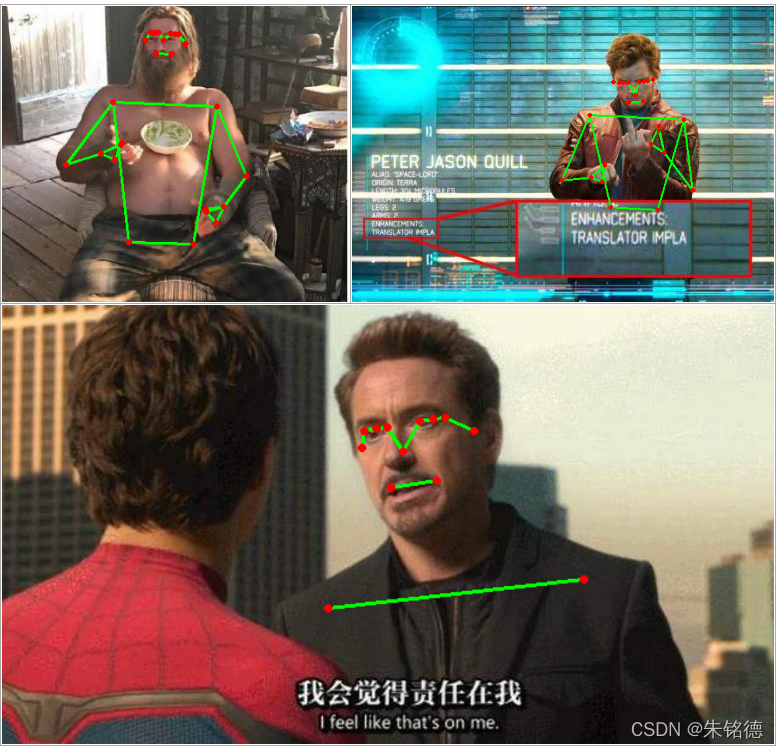
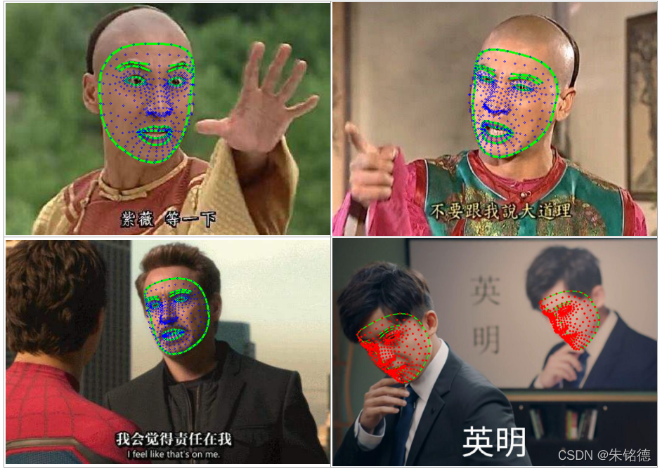
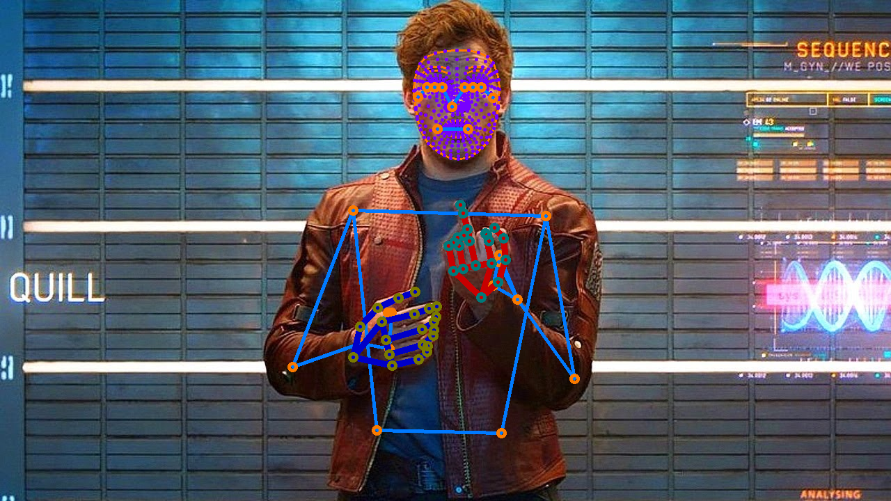
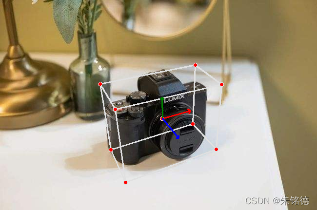
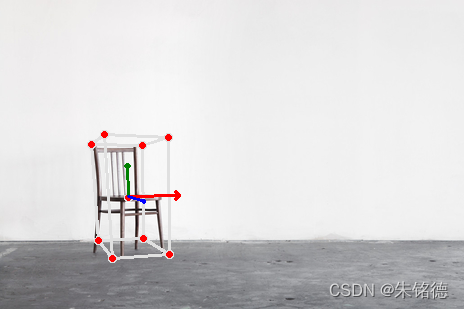
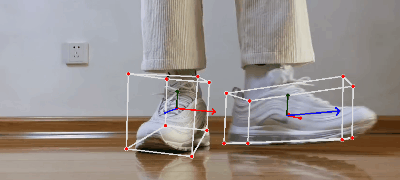

# Ten_Lines_AI_Projects
现阶段有非常多优秀的开源的AI工程，为了有更好的可扩展性，接口往往设计得十分复杂，这需要投入一定的时间和精力来处理，对于不熟悉或者刚入门的小伙伴，这可能需要花很久。
 
本系列设计的出发点也很纯粹，进一步降低小伙伴们挑选和使用轮子的时间，让更多小伙伴能更快地验证算法效果，算法满足效果了再扒开看看，不满意直接看下一个。有任何问题和建议欢迎随时评论，目前系列里的十行代码会按照下列方式进行：

        import  关键py
        1.定义好输入
        2.网络初始化配置
        3.开始跑并输出结果
        4.可视化结果

包含空格和一些必要的说明，估计正好十行。哈哈哈哈（不能再少了，再少我的强迫症就不能忍受了）。

如果遇到什么很牛逼的AI工程或者自己不想跑的但是一眼看上去效果很好的工程，欢迎留言交流哈，有空可以一并整理到这个工程，一键可运行，无繁杂使用过程。

--------------------------------------
## 详细列表
### 1.双手关键点追踪

|||
|-----------|---|---|

### 2.人体姿态追踪
|
---|---|

### 3.人脸关键点追踪

||
---|---|---|

### 4.全身关键点追踪

|
---|---|

### 5.人像分割

|
---|---|

### 6.物体3D姿态估计

||
---|---|---|

